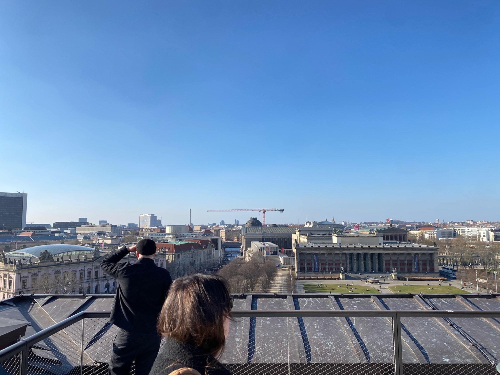
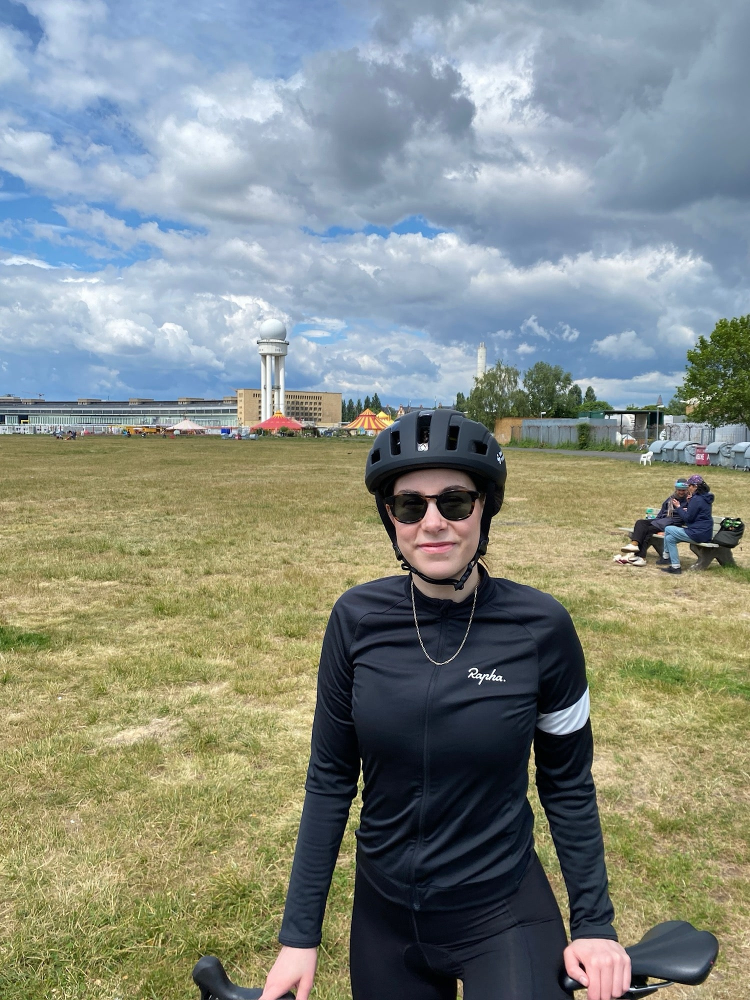
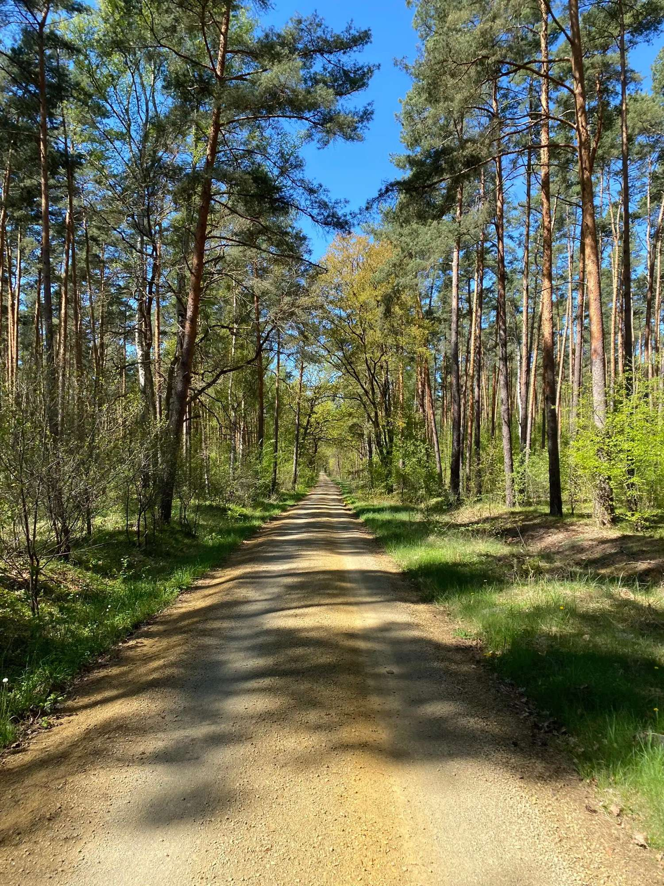
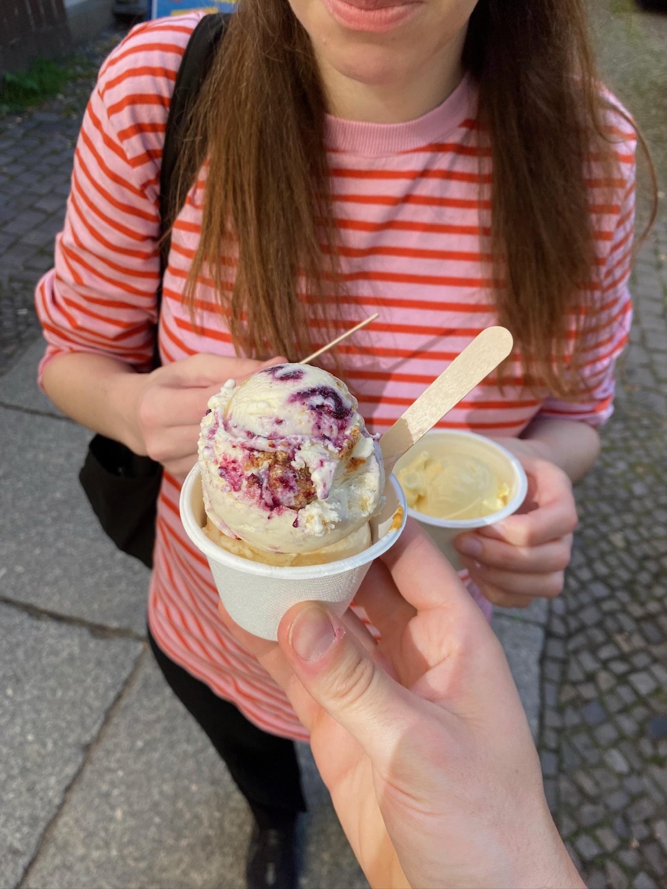
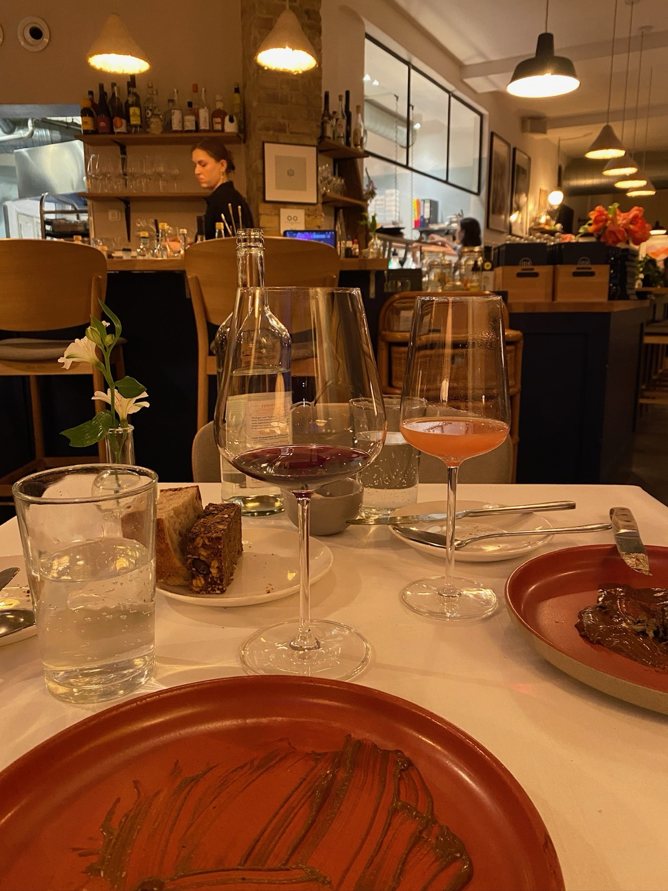
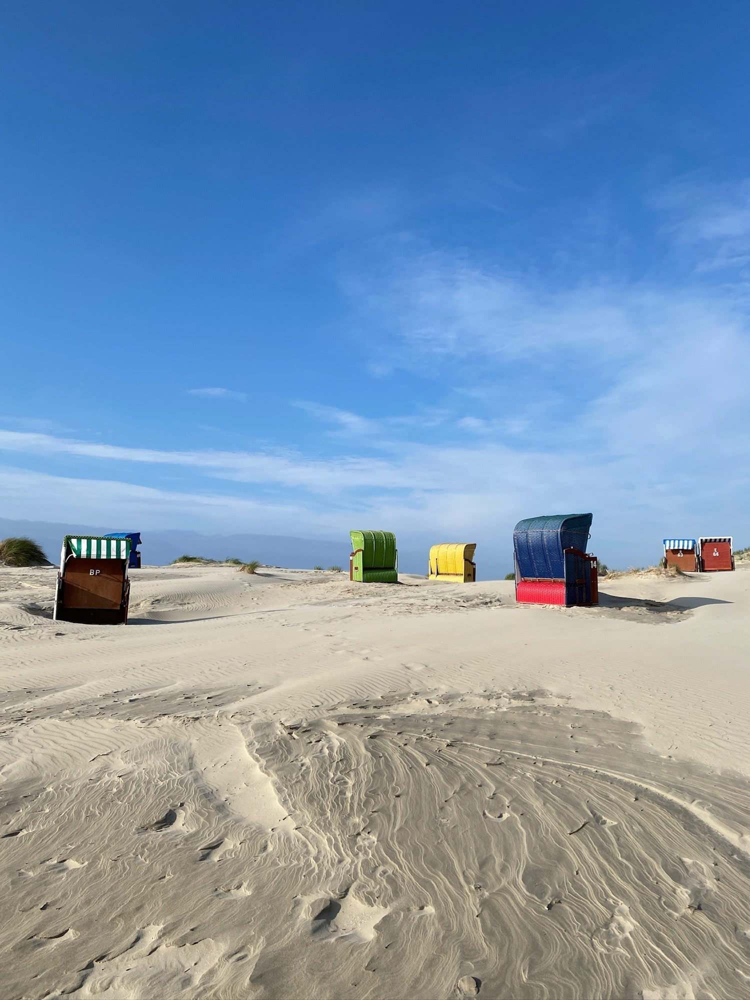
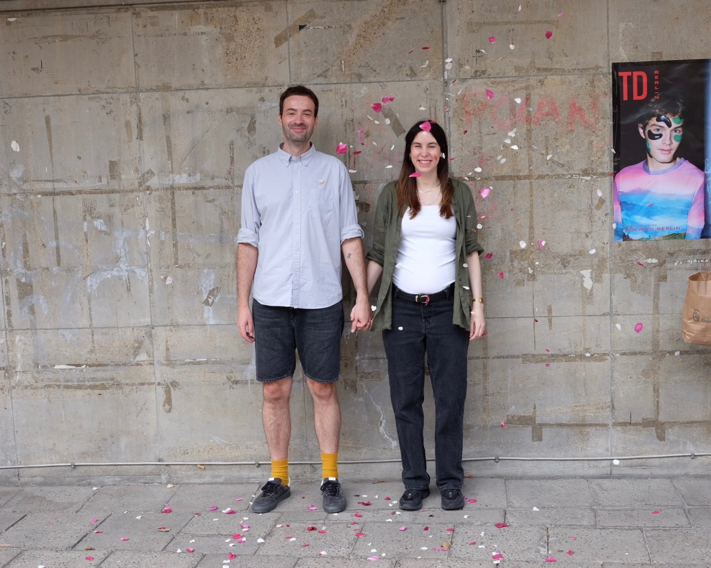
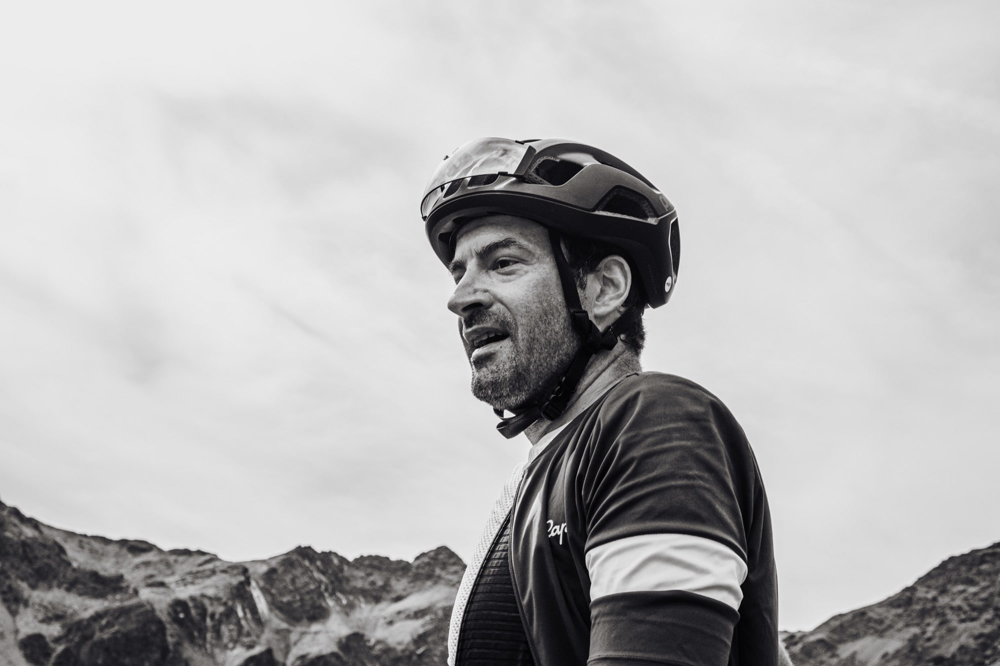
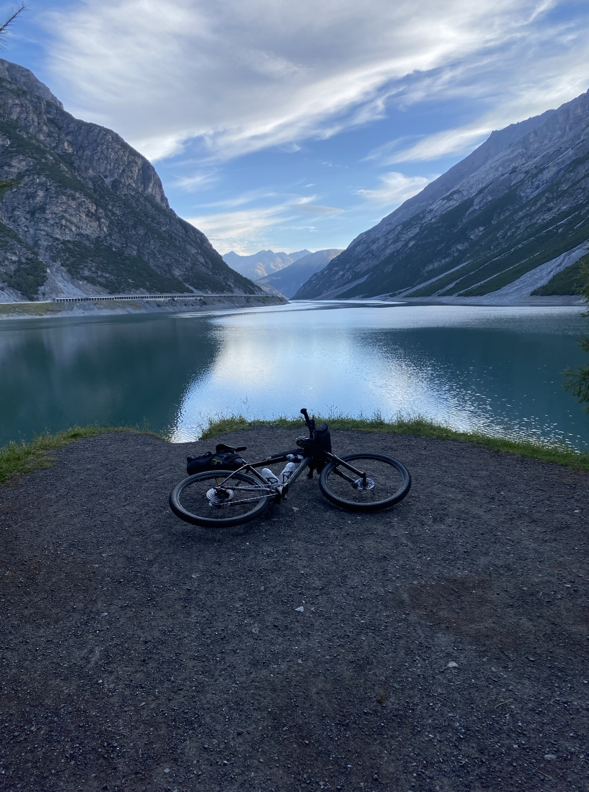
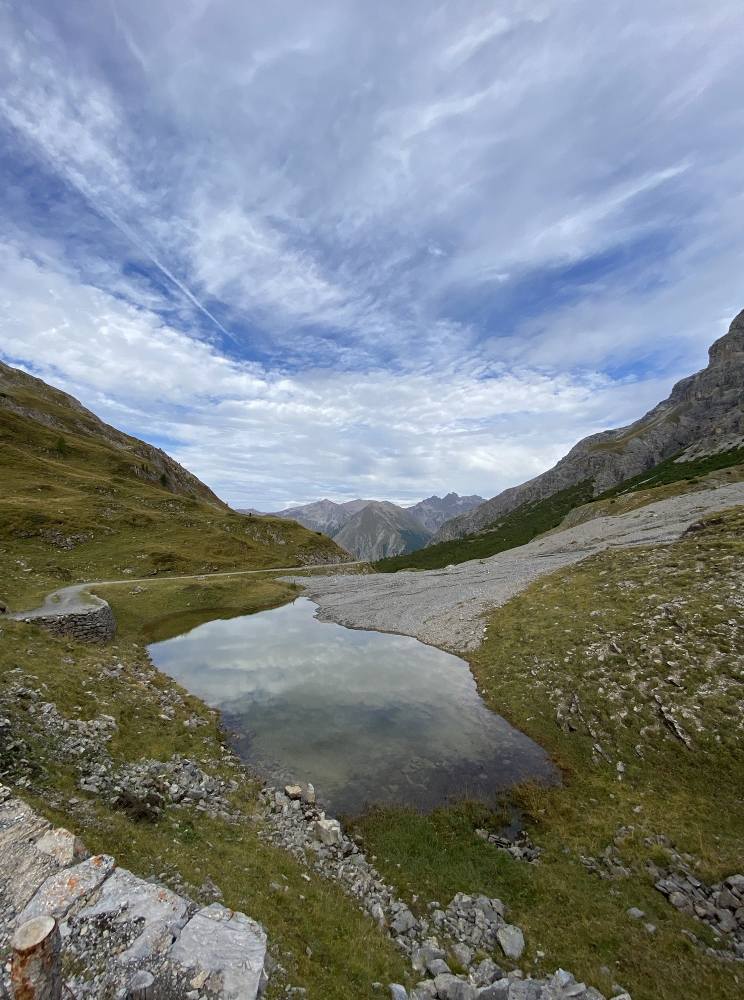

A lot has happened this year.

Arriving in Berlin.

We regularly spent time with my family in Upper Franconia.

We visited Hamburg regularly. Had a wonderful time in Berlin (with old and new friends).

Speaking of friends: Tobi and I visited Philipp in Mannheim.

We listened to [Soap & Skin](https://youtu.be/-DhQGc8FaaM?si=TO5fIxXA06y2d5Hq) at Volksbühne. Preparing for my first ultracycling event.

We were on holiday in Berlin. Enjoyed an evening at [FREA](https://www.frea.de/) (unfortunately permanently closed now) and visited Bad Saarow Therme.

Enjoyed a [PUP](https://youtu.be/aa3Afg3fzAQ?si=av2t0_Y42fkqhF-6) concert at Hole44.

Spent time on Borkum with Linnea's family.

A trip to [Paris](/blog/a-long-weekend-in-paris/) happened, including watching the Tour de France finale. 💛

Linnea and I got married on a whim. 💕

I rode my first ultracycling event in September. Here, I wrote more about [Sneak Peaks](/blog/sneak-peaks/).

_Picture from [Saskia Martin](https://www.instagram.com/saskiacmartin/)_

Two fantastic weeks of doing nothing in [Portugal](/blog/babymoon-in-portugal/).

The search for an apartment in Hamburg was successful.

The last quarter consisted mainly of preparations for the move, moving back to Hamburg, and settling into the new apartment.

It was a really good year. Deliberately exhausting, especially due to another move back to Hamburg. But also wonderful, as Linnea and I are returning as a married couple. Neither of us could have imagined that two or three years ago. We are currently preparing for our next adventure, as we are expecting a baby soon. It couldn't be better. I'm looking forward to the new year.

## Top 3 albums

- Turnstile - [Never enough](https://youtu.be/Nfk1Su1Q8SI?si=JMAjfzwSoWUNH56B)
- Deftones - [Private music](https://youtu.be/U_uVVO7eGic?si=BA1b3jJt4M9DHVv1)
- Baxter Dury - [Allbarone](https://youtu.be/8aDR5Wuhj6Q?si=htTuaExdE2dyBT-H)

And, as always, we listened a lot to [Mac DeMarco](https://youtu.be/csJZ_9KOtNY?si=N_m6-UsyhGLe1iFN). Also, I enjoyed the new [Kraftklub](https://youtu.be/6Jh5WcIp5jU?si=4D34VSfoo2UZ3ssD) album. ¯\\\_(ツ)\_/¯

## Time on the bike

- 119 rides
- 238 hours (~ 10 days)
- 4.838 km (total distance)
- 39.244 moe (meters of climbing)
