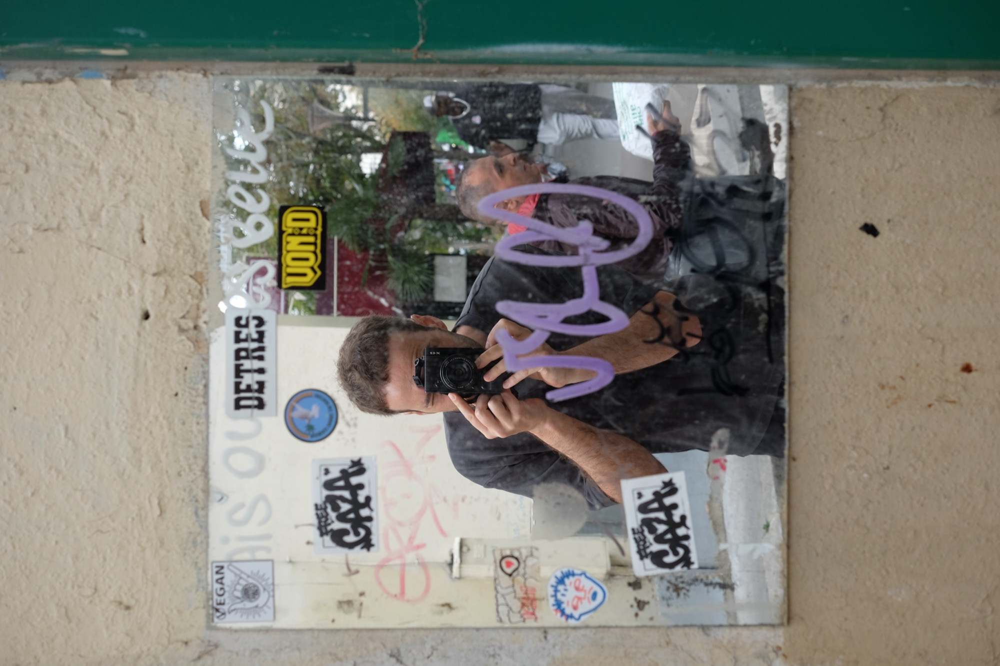

Paris had been on our list of places we wanted to visit for far too long. The excitement surrounding the Tour de France prompted us to take a spontaneous long weekend in Paris.

This city is beautiful. We quickly fell in love with it. We particularly enjoyed the easy-to-use public transport system, the wide selection of vegan and vegetarian food hot spots, and seeing Pogi live for the first time.

