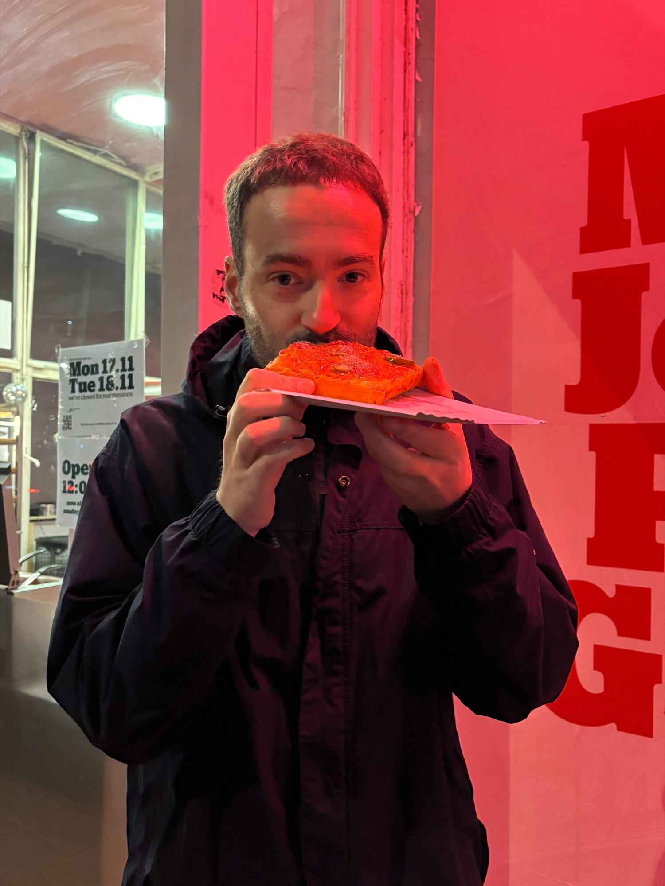
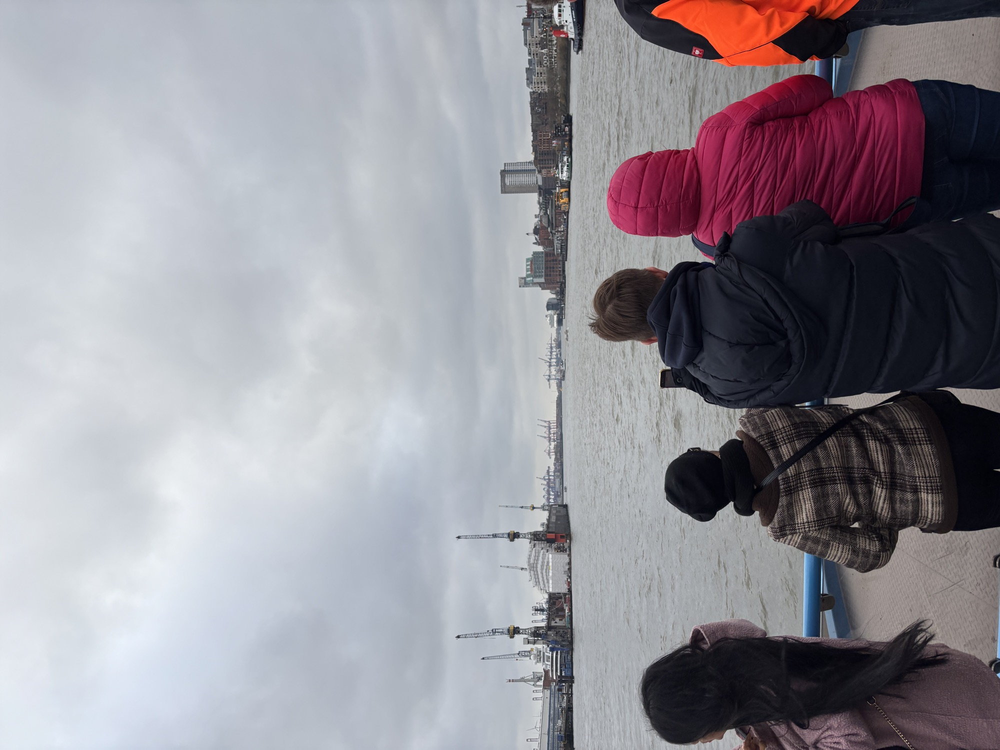

**TLDR:** [I want to read about Berlin](#living-in-berlin).

I can't remember exactly, but it must have been just before I turned 30. So sometime around the end of 2015, beginning of 2016. I needed a change. Hamburg had become boring, hadn't it? Not exciting enough anymore. I also didn't feel comfortable in the neighborhood where I had been living. At the time, I was living in my first apartment in Eimsbüttel, Lutterothstraße. I had left my shared apartment life behind and was enjoying living alone. But that also left me with more space to worry about everything. All the young and presumably happy families with their strollers, whom I had to pass on my way to work or to visit my friends, reminded me too much of a traditional life. Which felt far too conservative to me. After all, I was at a completely different point in my life. And that was fine. I had wonderful friends. I enjoyed being out and about, going to as many concerts as possible, and living in the here and now when I wasn't busy with work.

Every now and then, I also thought about just dropping everything and moving to Berlin.

So I looked for a more suitable environment in Hamburg. After a short time, I got lucky and found a new apartment in Altona-Altstadt. Near the Holstenstraße S-Bahn station. The apartment was more affordable than the previous one, and my best friends were close by again. Perfect!

## Fast forward to 2019

Life has changed completely.

I discovered cycling for myself in 2019. Gradually, I swapped long nights in bars for going to bed as early as possible so that I could spend as much time as possible on my bike at the weekends. I got to know Hamburg and the surrounding area in a completely different way.

Then everything changed again with COVID-19. For many, this was a negative change, especially in terms of health. I was lucky to be able to work from home a lot. At that time, I noticed more and more often that the unfairness of life in our capitalist system was weighing heavily on me. As a result, I spent even more time on my bike to distract myself from all the negative developments in our society.

The biggest highlight of 2020: at the last concert before the coronavirus lockdowns, I met up again with Linnea, a friend who is now my better half. 💕 And a special thanks to Kathi for the guest list back then.

My job at a so-called green FinTech company felt pretty good at first. But at some point, I realized that green capitalism won't save us. And that the climate crisis won't be solved by individual sacrifice. A system change is needed. But who cares about climate change these days, right? I'm digressing too much.

After a brief trip to Hamm in eastern Hamburg, Linnea and I moved back to Altona into a larger apartment. It was less than five minutes from Altona train station. It was beautiful. We had some wonderful moments in the area. We had many friends around us. And we went on some great trips. I am very grateful for that.

## What's next?

As wonderful as life in Hamburg and everything else was, familiar thoughts began to surface again: Was that it? Why are we still living in the city? Would I prefer to live in the countryside? Would I prefer to live in a larger city? Would I prefer to live abroad? In the mountains? Back in Franconia (Oberfranken maybe)?

Professionally, I hadn't been able to find a job that really suited me after my time at [Tomorrow](https://www.tomorrow.one/). It didn't feel right and seemed more like a big step backwards. So, after two short stints at larger companies, I finally found something exciting again: working on user-centered digitization projects in Germany. When I started at [DigitalService](https://digitalservice.bund.de/), the possibility of a change in our lives was no longer far off. I had been thinking about moving to Berlin for quite some time. The first time was shortly before I turned 30, as I mentioned at the beginning. Linnea felt the same way. So we took my job change to Berlin as an opportunity to cross Berlin off our list of things we would like to do in our lives.

## Living in Berlin

The start in **Berlin was difficult**. The apartment search was a disaster and, after several failed attempts, we decided to give up and move into the next available expensive new apartment in Europacity. The main thing was to stop looking for an apartment in Berlin for the time being. If we like it, we'll look for something else suitable later in the year.

**Berlin was really beautiful**. Meeting old friends again. Making new friends. Developing new routines. Getting to know the city from a whole new perspective. Constantly thinking: How big is this city? I had totally underestimated it. Exploring the area by bike. For example, on my longest day trip from Rostock to Berlin ([Komoot](https://www.komoot.com/de-de/tour/2251140565) / [Strava](https://strava.app.link/jRG0ZSF3xZb)). The job was fun, challenged me in new ways, and allowed me to soak up lots of new perspectives. We ate out a lot. Incredibly good food. Favorite spots:

- [Jones ice cream](https://maps.app.goo.gl/csqipyHsfFDgPMMc9) (Sicilian Pistachio)
- [19grams](https://maps.app.goo.gl/pR4fmyWbFKNy4wx78) (Basque Cheesecake)
- [Magic John’s Pizza](https://maps.app.goo.gl/bnH9CZ9Tyog5BT3c7) (Spicy Vodka)
- [Standard Serious Pizza](https://maps.app.goo.gl/diE69jqeZT95wk8i7) (Vegetarian Calzone)
- [Maroush](https://maps.app.goo.gl/f928rorcEcxfLryo7) (Makali Sandwich)
- [DASHI](https://maps.app.goo.gl/WjtjNKP8Dhiue3Tn8) (Szechuan Fries)
- [Saveur de Bánh Mì](https://maps.app.goo.gl/LMGTVjNB1TdxDpQU9) (vegan Bánh Mì)
- [Cô Chu](https://maps.app.goo.gl/PJ2vdoARgfiraF7x9) (Red Curry with Tofu)
- [Bonvivant](https://maps.app.goo.gl/shuuqfqCj8XfVc1i6) (Brunch)
- [Cookies Cream](https://maps.app.goo.gl/Rn4HeynGMfT8B6GNA) (Our all-time favorite for special vegetarian or vegan food)

However, **Berlin became quite exhausting**. Too many aggressive people. On foot and especially in cars. Another level of exhausting. A completely broken housing market. No good cycling infrastructure. Many good infrastructure things are being dismantled to make more room for cars again. Thank you, CDU. 🤦 Overcrowded and constantly delayed public transport. In my opinion, everything that is necessary for a pleasant city life for everyone simply did not work well. The closer the first year in Berlin came, the more we missed our familiar surroundings in Hamburg. I found myself wondering more and more how I could have come up with the idea of trading the relaxed and far better functioning cycling and public transport infrastructure in Hamburg for Berlin.

I realized: I couldn't eat enough delicious slices of deep dish pizza to make Berlin bearable for me in the long run.

After six months in Berlin, Linnea and I began searching again for an affordable apartment in Berlin and Hamburg. A few weeks later, we gave up looking for a new place in Berlin. Our longing for our old home in Hamburg became too strong. In addition, our great network of friends in Hamburg kept sending us good apartment offers. It still seems absolutely absurd to me how it is possible to destroy the Berlin apartment market in such a short time. During our apartment search in Berlin, we couldn't find a 3-room apartment for less than 2000 euros (cold) that we could seriously consider moving into. Every now and then there were offers around 1600 euros from a Genossenschaft. Crazy.

## Back to Hamburg

Ten weeks ago, in mid-October, we signed the lease for an apartment in Hamburg-Eimsbüttel. It was anything but easy, but it worked out. Thanks a lot to all our friends and family that supported us. And a special thank you to Ben, you know why. ❤️ We have been living in Hamburg again for six weeks now. It feels very good.

Change takes a lot of courage and strength. Our time in Berlin was wonderful, but also exhausting. I am glad that I (we) gave Berlin a chance. And I am even happier that I can now enjoy Hamburg to the fullest again.

What will it look like in 10 years? I'm excited to find out.

Learned lessons for life:

- Never terminate the current lease agreement before a new lease agreement has been signed by all parties.
- Be sure to try new things if your current life doesn't feel right.
- Good friendships can last even over long distances if both parties take the time now and then to keep each other up to date.
- Many things in life are much easier when you have someone by your side.
- If you can afford it right now: go to that new fancy restaurant, take a trip to the sun or the mountains for as long as you can.
- Cycling not only keeps you fit, it also slows you down and gives you great new perspectives.
